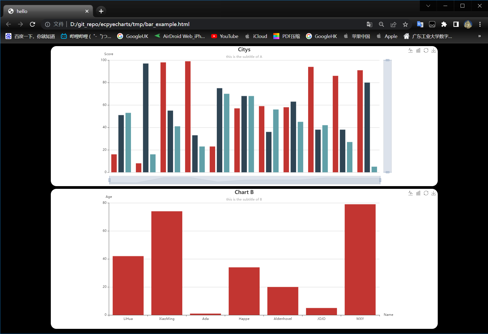

# ecpyecharts

## Introduction

Choosing [Apache Echarts](https://github.com/apache/echarts) for data visualization is a wise decision. However, since echarts is primarily a JavaScript library designed for frontend data visualization in web browsers, it may not be very convenient for backend developers who prioritize efficiency. As a result, a Python version of echarts called [pyecharts](https://github.com/pyecharts/pyecharts) has been developed to address this issue.

With pyecharts, you can directly generate echarts charts within Python scripts. It offers powerful functionality, allowing you to achieve almost all the features available in native echarts. Moreover, pyecharts provides extensive documentation and enjoys support from a vibrant community of developers.

**So why do we need ecpyecharts?**

We have discovered that data visualization is actually a discipline that combines both technology and art. The powerful and versatile tools like echarts and pyecharts provide a solid technical foundation, but when developers use these technologies to build their own visual reports, the results can be disappointing. This is because inappropriate visualization combinations may go against visual preferences.

Our development goal for ecpyecharts is to simplify the design burden for developers by subtracting from echarts and pyecharts, providing more concise, higher integration, and visually appealing customized visualization report templates.

## Examples



```python
import random
from ecpyecharts.html import HTMLTemplate
from ecpyecharts.charts.bar import BarOption

html = HTMLTemplate(title="hello", background_color="black")
op = BarOption(title="Citys", subtitle="this is the subtitle of A", xaxis='Metric', yaxis='Score')
op.init_option(xdata=['A', 'B', 'C', 'D', 'E', 'F', 'G', 'H', 'I', 'J', 'K'],
               ydata={'BJ': [random.randint(0, 100) for _ in range(11)],
                      'SH': [random.randint(0, 100) for _ in range(11)],
                      'HK': [random.randint(0, 100) for _ in range(11)]
                      })
html.add_chart(op)

op = BarOption(title="Chart B", subtitle="this is the subtitle of B", xaxis='Name', yaxis='Age')
op.init_option(xdata=['LiHua', 'XiaoMing', 'Ada', 'Happe', 'Aldenhovel', 'JOJO', 'MXY'],
               ydata={'Age': [random.randint(0, 100) for _ in range(7)], })
html.add_chart(op)
html.export('../tmp/bar_example.html')
```

As shown in the code and the resulting image above, this example is located in `examples/bar_example.py` and can generate an HTML report webpage using a simple method.


**More templates will be updated in future updates.**