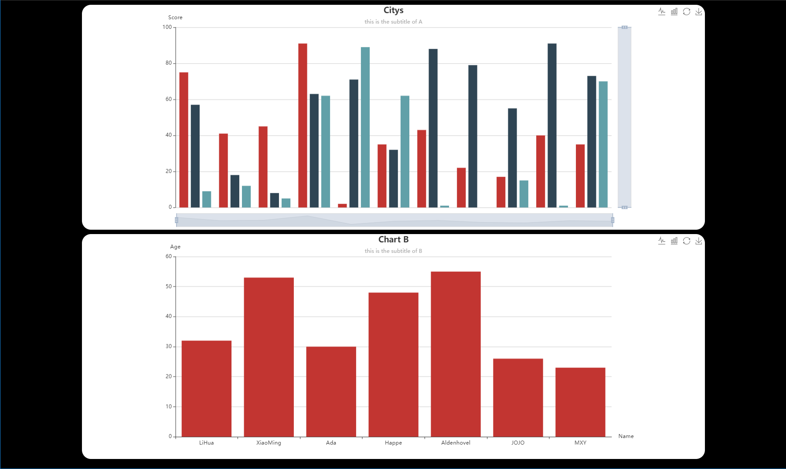

# ecpyecharts

## 简介

对于数据可视化来说，选择[Apache echarts](https://github.com/apache/echarts)是明智之举。但由于echarts是基于JavaScript主要用于浏览器前端的数据可视化库，对于一些追求效率的后端开发者来说使用起来并不是特别方便，因此有了基于Python版本的[pyecharts](https://github.com/pyecharts/pyecharts)。

使用pyecharts可以直接在Python脚本中生成echarts报表，它的功能十分强大，基本可以实现echarts原生的所有功能，而且也有非常丰富的文档和社区开发者支持。

**那为什么还要ecpyecharts?**

我们发现其实数据可视化是一门兼顾技术和艺术的学问，丰富且万能的echarts和pyecharts为技术支持打下牢固基础，但是开发者真正使用这些技术自己搭建可视化报表时结果可能会很糟糕，因为不合理的可视化搭配可能会违背视觉偏好。

我们的ecpyecharts开发目的在于简化开发者的设计负担，对echarts和pyecharts做减法，提供使用更加简洁、集成度更高且效果更加漂亮的定制可视化报表模板。


## 示例



```python
import random
from ecpyecharts.html import HTMLTemplate
from ecpyecharts.charts import BarTemplate

# create a html template
html = HTMLTemplate(title="hello", background_color="black")

# create a bar chart template and init it, append it into the html template
chart = BarTemplate(title="Citys", subtitle="this is the subtitle of A", xaxis='Metric', yaxis='Score')
chart.init_option(xdata=['A', 'B', 'C', 'D', 'E', 'F', 'G', 'H', 'I', 'J', 'K'],
               ydata={'BJ Score': [random.randint(0, 100) for _ in range(11)],
                      'SH Score': [random.randint(0, 100) for _ in range(11)],
                      'HK Score': [random.randint(0, 100) for _ in range(11)]
                      })
html.append_chart(chart)

# create the 2nd chart and append it into html template
chart = BarTemplate(title="Chart B", subtitle="this is the subtitle of B", xaxis='Name', yaxis='Age')
chart.init_option(xdata=['LiHua', 'XiaoMing', 'Ada', 'Happe', 'Aldenhovel', 'JOJO', 'MXY'],
               ydata={'Age': [random.randint(20, 65) for _ in range(7)],})
html.append_chart(chart)

# export the html template to a file
html.export('../tmp/bar_example.html')
```

如上面的代码和效果图所示，这个例子位于 `examples/bar_example.py` 通过简单方法即可生成一个 HTML 报表网页。


**更多模板会后续更新**

