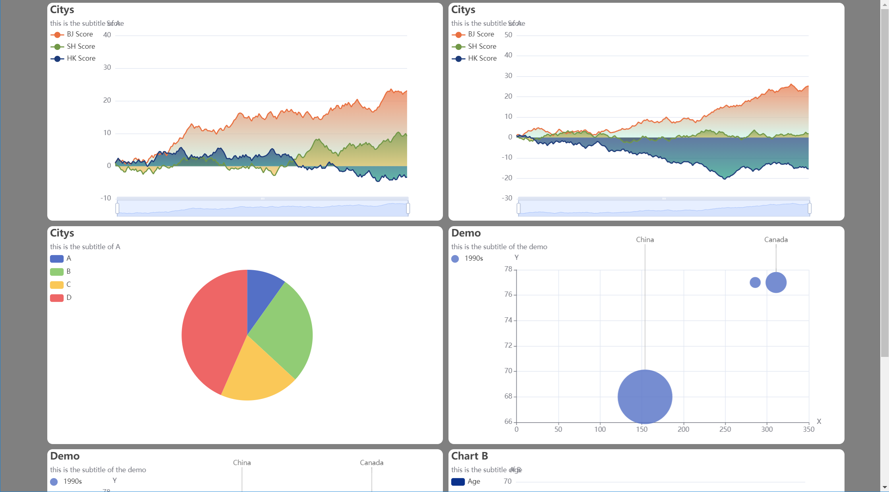
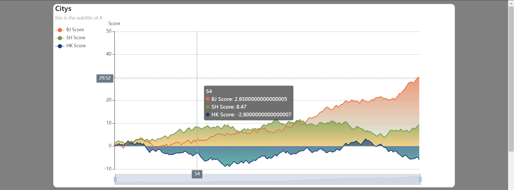
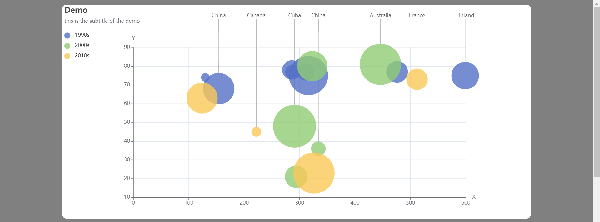

<h1 align="center">ecpyecharts</h1>
<h3 align="center">(Easy Python Echarts)</h3>
<hr>
<h4 align="center">
    <p>
        <a href="https://github.com/Aldenhovel/ecpyecharts/blob/main/README.md">简体中文</a> |
        <b>English</b> 
    <p>
</h4>

## Introduction

Choosing [Apache Echarts](https://github.com/apache/echarts) for data visualization is a wise decision. However, since echarts is primarily a JavaScript library designed for frontend data visualization in web browsers, it may not be very convenient for backend developers who prioritize efficiency. As a result, a Python version of echarts called [pyecharts](https://github.com/pyecharts/pyecharts) has been developed to address this issue.

With pyecharts, you can directly generate echarts charts within Python scripts. It offers powerful functionality, allowing you to achieve almost all the features available in native echarts. Moreover, pyecharts provides extensive documentation and enjoys support from a vibrant community of developers.

**So why do we need ecpyecharts?**

We have discovered that data visualization is actually a discipline that combines both technology and art. The powerful and versatile tools like echarts and pyecharts provide a solid technical foundation, but when developers use these technologies to build their own visual reports, the results can be disappointing. This is because inappropriate visualization combinations may go against visual preferences.

Our development goal for ecpyecharts is to simplify the design burden for developers by subtracting from echarts and pyecharts, providing more concise, higher integration, and visually appealing customized visualization report templates.

## Examples

- Using tight HTML template.

- Using basic HTML template.



## How to use ecpyecharts

1. Download or clone this repository.
```bash
git clone git@github.com:Aldenhovel/ecpyecharts.git && cd ecpyecharts
```

2. Find the desired template in `examples/`.
```bash
cd examples
```

3. Edit the code file corresponding to the template, and replace the data in the sample code with your own data.
```bash
cp xxx_example.py my_test.py
vi my_test.py
```

4. Please refer to this code snippet, which briefly introduces the most direct way to use ecpyecharts.

```python
import random
from ecpyecharts.html import HTMLTemplate
from ecpyecharts.charts import BarTemplate

# create a html template
html = HTMLTemplate(title="hello", background_color="gray")

# create a bar chart template 
# init it with data
chart = BarTemplate(title="Citys", subtitle="this is the subtitle of A", xaxis='Metric', yaxis='Score')
chart.init_option(xdata=['A', 'B', 'C', 'D', 'E', 'F', 'G', 'H', 'I', 'J', 'K'],
               ydata={'BJ Score': [random.randint(0, 100) for _ in range(11)],
                      'SH Score': [random.randint(0, 100) for _ in range(11)],
                      'HK Score': [random.randint(0, 100) for _ in range(11)]
                      })

# Once the chart is initialized, 
# we can append it into the html template
html.append_chart(chart)

# export the html template to a file
html.export('../tmp/bar_example.html')
```

Templates will be placed in `examples/`. If you want to view the running results, please view the corresponding HTML files in `tmp/`.

**More templates will be updated later**