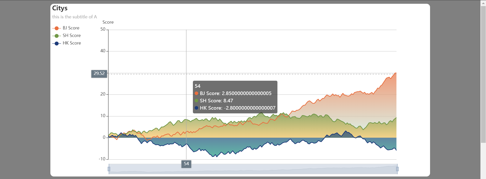

## HTML模板 HTML Template
选择一个HTML模板是画图的前提，不同的HTML模板意味着图表排列顺序和位置的差异，为了适应不同的显示环境，这里提供了这些模板可供选择：

Selecting an HTML template is the premise of drawing. Different HTML templates mean differences in the order and position of the charts. In order to adapt to different display environments, these templates are provided here for selection:
### 1 紧凑模板 Tight Template
`tight_html_example.py`

### 2 标准模板 Standard Template
其他示例展示均为标准模板。

Other examples shown are standard templates.

## 图 Charts 

所有效果图在 `tmp/` 下有 HTML 文件对应，请以那个为准。

All results have corresponding HTML files under `tmp/`, please take that as the standard.

### 1 柱状图 Bar
`bar_example.py`

### 2 折线图 Line
`line_example.py`

### 3 饼图 Pie
`pie_example.py`

### 4 散点图 Scatter
`scatter_example.py`

### 5 蜡烛图（K线图） CandleStick
`candlestick_example.py`

