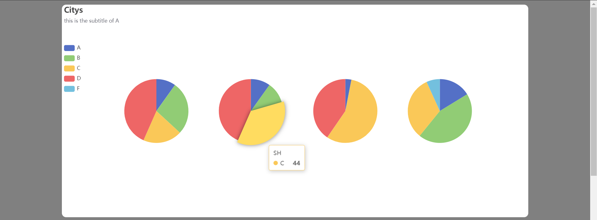
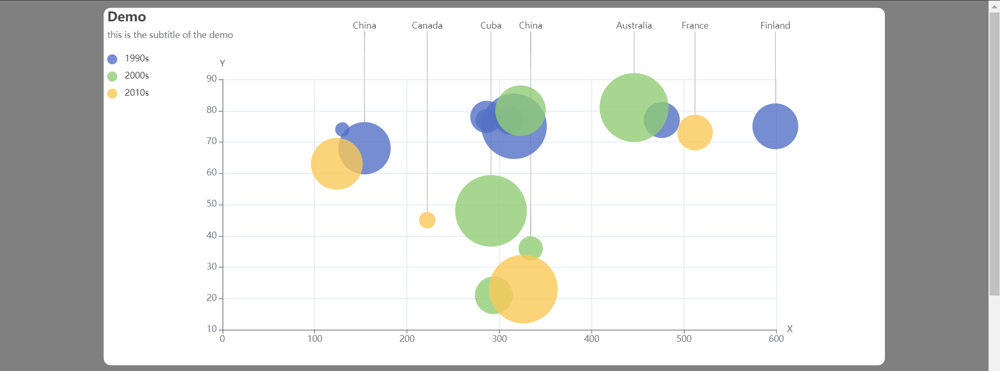

## HTML模板 HTML Template
选择一个HTML模板是画图的前提，不同的HTML模板意味着图表排列顺序和位置的差异，为了适应不同的显示环境，这里提供了这些模板可供选择：

Selecting an HTML template is the premise of drawing. Different HTML templates mean differences in the order and position of the charts. In order to adapt to different display environments, these templates are provided here for selection:

### 1 标准模板 Standard Template
*src:* `bar_example.py` .

### 2 紧凑模板 Tight Template
*src:*  `tight_html_example.py`

### 3 非常紧凑模板 Very-Tight Template
*src:* `verytight_html_example.py`

### 4 超级紧凑模板 Super-Tight Template
*src:* `supertight_html_example.py`

### 3 模板合并 Template Extend
*src:*  `extend_html.py` .

这是一个**实验性功能**，并不推荐使用，因为它可以将类型不同的模板合并到一起产生一个综合的模板，以实现在同一个HTML页面中显示不同尺寸图表。

This is an experimental feature and is not recommended, because it can combine different types of templates together to generate a comprehensive template to display charts of different sizes in the same HTML page.

## 图 Charts 

所有效果图在 `tmp/` 下有 HTML 文件对应，请以那个为准。

All results have corresponding HTML files under `tmp/`, please take that as the standard.

### 1 柱状图 Bar
*src:* `bar_example.py` .

### 2 折线图 Line
*src:* `line_example.py` .

### 3 饼图 Pie
*src:* `pie_example.py` .

### 4 散点图 Scatter
*src:* `scatter_example.py` .

### 5 蜡烛图（K线图） CandleStick
*src:* `candlestick_example.py` .

